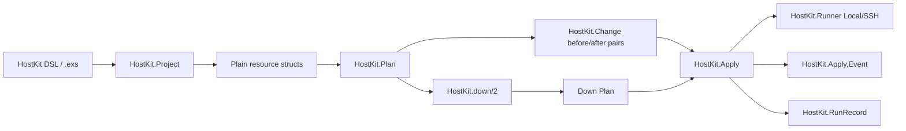
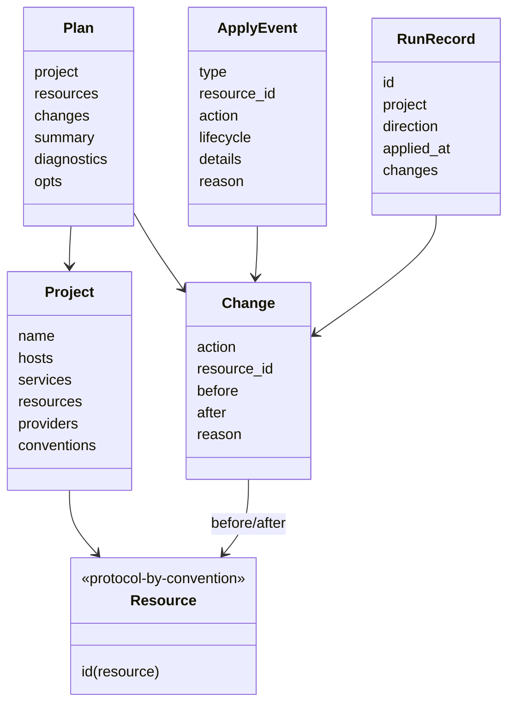
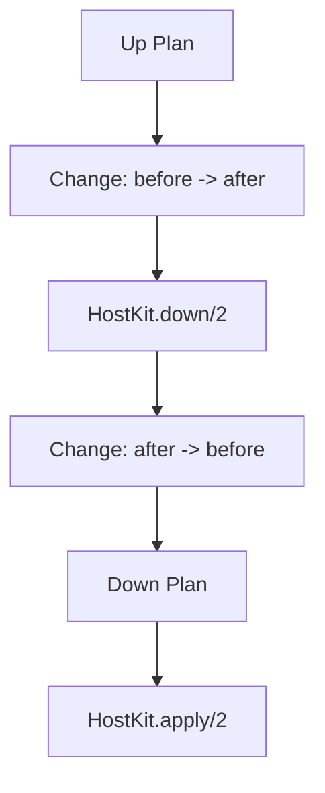
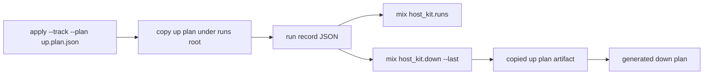
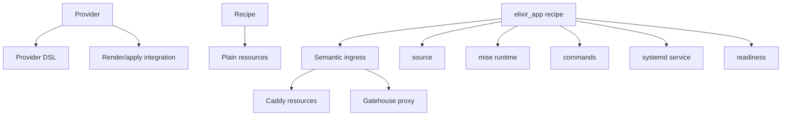
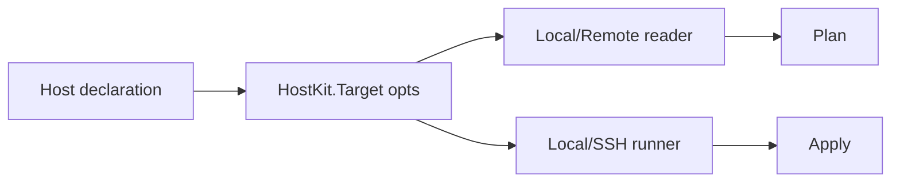

# Internal architecture

This guide describes the core HostKit runtime shape. It is for contributors and advanced users who want to understand how declarations become inspectable plans, how plans are applied, and why rollback is represented as another plan.

## Core flow



The key rule is: **the plan is the operational unit**. A rollback is not a separate migration system; it is a down plan derived from an existing plan and applied through the same apply engine.

## Main entities



### `HostKit.Project`

A project is the compiled form of a HostKit declaration. The DSL is only a builder; it should compile to plain structs that can be inspected without applying anything.

A project owns:

- declared hosts,
- services and their scoped resources,
- top-level resources,
- enabled providers,
- provider config,
- project conventions such as path roots and naming prefixes.

### Resource structs

Resources describe desired state or an operational step. Examples:

- `%HostKit.Resources.File{}`
- `%HostKit.Resources.EnvFile{}`
- `%HostKit.Systemd.Service{}`
- `%HostKit.Resources.Command{}`
- `%HostKit.Resources.Readiness{}`
- `%HostKit.Proxy{}`
- `%HostKit.Ingress{}`

Resources are intentionally ordinary structs. `HostKit.Resource.id/1` gives each resource a stable resource id.

### `HostKit.Plan`

A plan is a resolved, ordered view of resources and changes. It contains:

- `resources`: resources after resolution/expansion,
- `changes`: `HostKit.Change` entries,
- `diagnostics`: warnings/errors from planning,
- `opts`: target/planning metadata.

Planning can compare desired resources with actual host state when a reader is configured. That is what makes rollback meaningful: changes can carry both `before` and `after`.

### `HostKit.Change`

A change is the smallest apply unit:

```elixir
%HostKit.Change{
  action: :update,
  resource_id: {:file, "/etc/app.env"},
  before: old_file,
  after: new_file,
  reason: :drift
}
```

For ordinary updates:

- `after` is the up direction,
- `before` is the down direction.

### Down plans

`HostKit.down(plan)` reverses supported changes into another `%HostKit.Plan{}`.



Commands are semantic operations, so HostKit cannot infer an opposite command. A command must declare its down behavior:

```elixir
command :migrate,
  exec: {"bin/app", ["eval", "App.Release.migrate()"]},
  phase: :before_start,
  down: {"bin/app", ["eval", "App.Release.rollback()"]}
```

Supported command down policies:

- `down: %HostKit.Resources.Command{}` — emit this command in the down plan,
- `down: :noop` — explicitly no down action,
- `down: :irreversible` — omit and warn,
- `down: nil` — omit and warn.

### `HostKit.Apply`

Apply executes changes through the configured runner. The same apply engine handles up plans and down plans.

Apply emits mailbox events when `reporter: pid` is configured:

```elixir
HostKit.apply(plan, confirm: true, reporter: self())
```

Events are sent as:

```elixir
{HostKit.Apply, %HostKit.Apply.Event{}}
```

HostKit also emits `[:apply, :event]` telemetry for every apply event. SSH retry events are mirrored to Logger by default for later collection; pass `log_events: true` to mirror all apply events.

### `HostKit.Apply.Event`

Events are the primary user-facing progress API. They cover:

- apply lifecycle,
- change lifecycle,
- command lifecycle metadata,
- service restart/readiness progress,
- HTTP health checks,
- SSH transport retry progress for connection establishment.

Lifecycle command events include:

```elixir
%{
  phase: :before_start,
  operation: :migrate,
  direction: :up
}
```

Readiness events include service and health details, for example:

```elixir
%HostKit.Apply.Event{
  type: :health_check_passed,
  resource_id: {:readiness, :app_ready},
  details: %{url: "http://127.0.0.1:4000/health"}
}
```

### `HostKit.Resources.Readiness`

Readiness waits for generated or user-declared startup checks:

```elixir
ready :app_ready, timeout: 60_000 do
  systemd("app.service", restart: true, kill: true)
  http("http://127.0.0.1:4000/health", body: "ok")
end
```

Recipes such as `elixir_app` can emit readiness automatically. During apply, readiness emits progress events for restarts, active services, waiting checks, pass/fail, and timeout.

### `HostKit.RunRecord`

Run records are minimal tracking artifacts written when apply is called with `track: true` or `mix host_kit.apply --track`.



They intentionally do not replace plans. They store compact metadata such as:

- run id,
- project,
- direction,
- applied timestamp,
- resource ids/actions/statuses,
- copied up/down plan artifact references when available.

The storage roots are based on project conventions:

```elixir
roots hostkit_state: "/var/lib/hostkit"
# derived defaults:
# hostkit_runs: "/var/lib/hostkit/runs"
# hostkit_backups: "/var/lib/hostkit/backups"
```

## Providers, recipes, and semantic resources



- **Providers** own integrations such as Caddy and Gatehouse.
- **Recipes** compose high-level patterns into plain resources.
- **Semantic resources** such as ingress are expanded during planning into provider-specific resources.

## Targeting and runners



A target controls how HostKit reads current state and applies changes. Mix tasks are thin wrappers around the runtime API.

## Design constraints

- DSLs compile to plain structs.
- Runtime API is primary; Mix tasks wrap it.
- Plans are inspectable and artifact-friendly.
- Rollback is a down plan, not a separate migration system.
- Apply progress is mailbox-driven via `reporter: pid`.
- Telemetry may mirror events, but it is not the primary apply API.
- Secrets should remain secret-safe in artifacts and logs.
