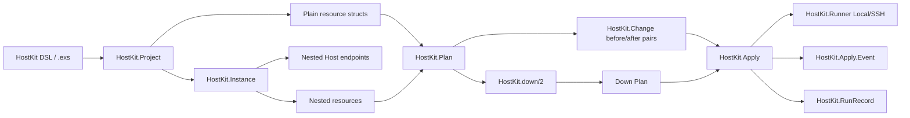
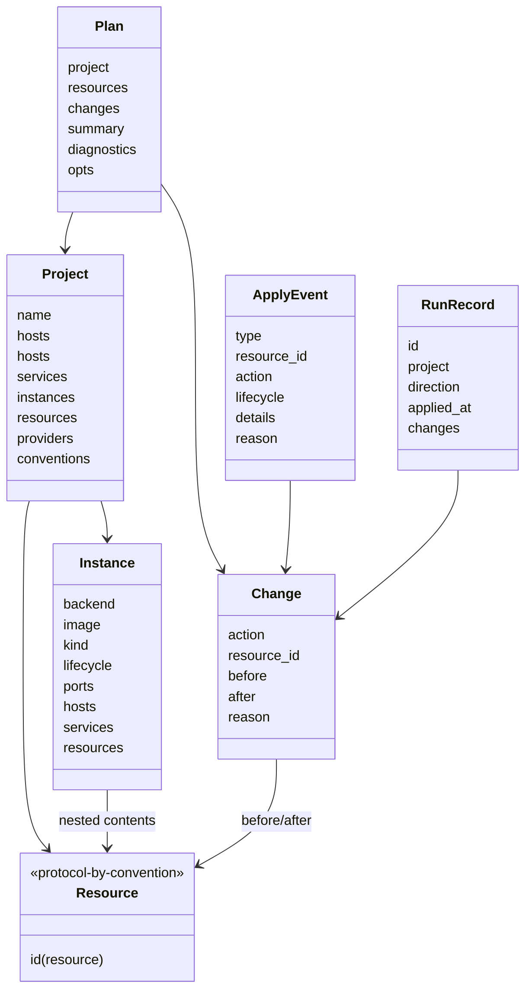
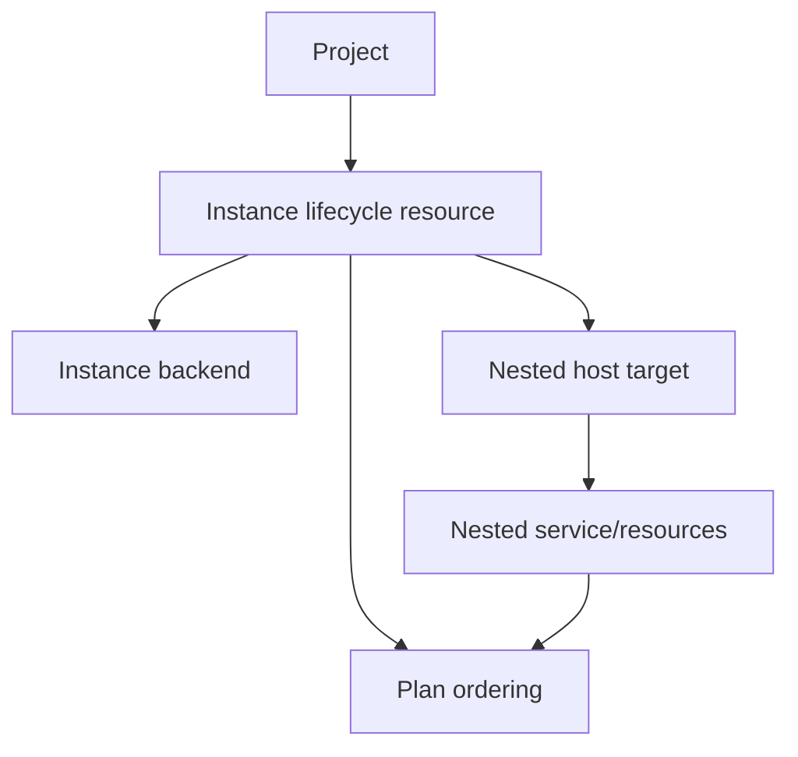
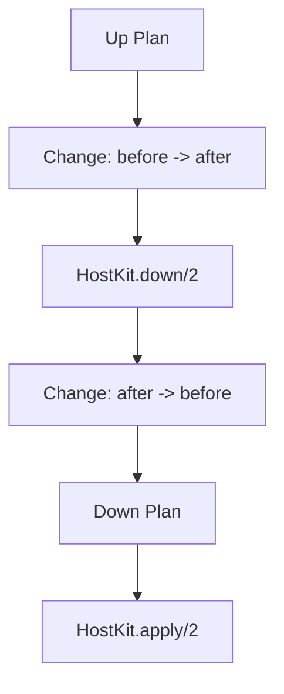
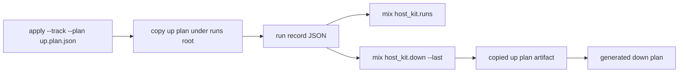
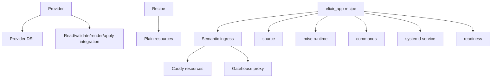
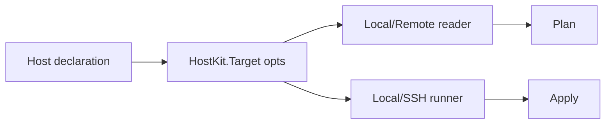
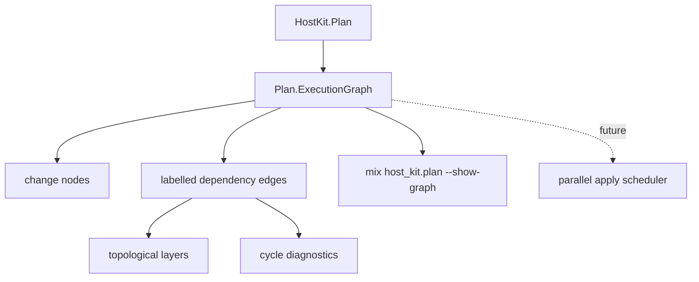

# Internal architecture

This guide describes the core HostKit runtime shape. It is for contributors and advanced users who want to understand how declarations become inspectable plans, how plans are applied, and why rollback is represented as another plan.

## Core flow



The key rule is: **the plan is the operational unit**. A rollback is not a separate migration system; it is a down plan derived from an existing plan and applied through the same apply engine. Release work follows the same rule; see [Release design notes](release-design.md) for the boundary between release/artifact state, runtime declarations, and verification.

## Main entities



### `HostKit.Project`

A project is the compiled form of a HostKit declaration. The DSL is only a builder; it should compile to plain structs that can be inspected without applying anything.

A project owns:

- declared hosts,
- lifecycle-managed instances,
- services and their scoped resources,
- top-level resources,
- enabled providers,
- provider config,
- project conventions such as path roots and naming prefixes.

Top-level hosts describe existing connection endpoints. Instances describe lifecycle-managed compute boundaries. A host nested inside an instance describes how HostKit connects into that managed boundary.

### Resource structs

Resources describe desired state or an operational step. Examples:

- `%HostKit.Resources.File{}`
- `%HostKit.Resources.Symlink{}`
- `%HostKit.Resources.EnvFile{}`
- `%HostKit.Systemd.Service{}`
- `%HostKit.Resources.Command{}`
- `%HostKit.Resources.Readiness{}`
- `%HostKit.Proxy{}`
- `%HostKit.Ingress{}`

Resources are intentionally ordinary structs. `HostKit.Resource.id/1` gives each resource a stable resource id.

### `HostKit.Instance`

Instances are planned as lifecycle resources before their nested contents. The instance backend is selected by `backend`, while nested hosts remain ordinary connection endpoints.



The generic ordering rule is:

1. create/start/update the instance through its backend,
2. resolve the nested host target (`target_host` when set, otherwise the first nested host),
3. read/apply nested resources through that target.

Down-plan ordering reverses nested content before instance lifecycle: nested resources are rolled back first, and an ephemeral instance delete is emitted last. Persistent instances are skipped with warnings instead of being destroyed implicitly.

This keeps `host` and `instance` separate: `host` is how HostKit connects; `instance` is what HostKit manages as compute lifecycle.

### `HostKit.Plan`

A plan is a resolved, ordered view of resources and changes. It contains:

- `resources`: resources after resolution/expansion,
- `changes`: `HostKit.Change` entries,
- `diagnostics`: warnings/errors from planning,
- `opts`: target/planning metadata.

Planning can compare desired resources with actual host state when a reader is configured. That is what makes rollback meaningful: changes can carry both `before` and `after`.

### `HostKit.Change`

A change is the smallest apply unit:

```elixir
%HostKit.Change{
  action: :update,
  resource_id: {:file, "/etc/app.env"},
  before: old_file,
  after: new_file,
  reason: :drift
}
```

For ordinary updates:

- `after` is the up direction,
- `before` is the down direction.

### Down plans

`HostKit.down(plan)` reverses supported changes into another `%HostKit.Plan{}`. Down-plan coverage is stored on the plan summary; it is not a separate rollback entity.



Commands are semantic operations, so HostKit cannot infer an opposite command. A command must declare its down behavior:

```elixir
command :migrate,
  exec: {"bin/app", ["eval", "App.Release.migrate()"]},
  phase: :before_start,
  down: {"bin/app", ["eval", "App.Release.rollback()"]}
```

Supported command down policies:

- `down: %HostKit.Resources.Command{}` — emit this command in the down plan,
- `down: :noop` — explicitly no down action,
- `down: :irreversible` — omit and warn,
- `down: nil` — omit and warn.

### `HostKit.Apply`

Apply executes changes through the configured runner. The same apply engine handles up plans and down plans.

Apply emits mailbox events when `reporter: pid` is configured:

```elixir
HostKit.apply(plan, confirm: true, reporter: self())
```

Events are sent as:

```elixir
{HostKit.Apply, %HostKit.Apply.Event{}}
```

HostKit also emits `[:apply, :event]` telemetry for every apply event. SSH retry events are mirrored to Logger by default for later collection; pass `log_events: true` to mirror all apply events.

### `HostKit.Apply.Event`

Events are the primary user-facing progress API. They cover:

- apply lifecycle,
- change lifecycle,
- command lifecycle metadata,
- instance lifecycle progress,
- service restart/readiness progress,
- HTTP health checks,
- SSH transport retry progress for connection establishment.

Lifecycle command events include:

```elixir
%{
  phase: :before_start,
  operation: :migrate,
  direction: :up
}
```

Instance events include backend lifecycle details for launch, port exposure, readiness wait, and SSH bootstrap:

```elixir
%HostKit.Apply.Event{
  type: :instance_expose_started,
  resource_id: {:instance, :demo_vm},
  details: %{backend: :incus, name: :ssh, host: 2222, guest: 22}
}
```

Readiness events include service and health details, for example:

```elixir
%HostKit.Apply.Event{
  type: :health_check_passed,
  resource_id: {:readiness, :app_ready},
  details: %{url: "http://127.0.0.1:4000/health"}
}
```

### `HostKit.Resources.Readiness`

Readiness waits for generated or user-declared startup checks:

```elixir
ready :app_ready, timeout: 60_000 do
  systemd("app.service", restart: true, kill: true)
  http("http://127.0.0.1:4000/health", body: "ok")
end
```

Recipes such as `elixir_app` can emit readiness automatically. Readiness planning checks current health like any other resource: healthy checks are no-op, unhealthy checks are active. Healthy readiness is also re-triggered when the dependency graph shows that an upstream resource changed, for example a release symlink or systemd unit that feeds the checked service. During apply, readiness emits progress events for restarts, active services, waiting checks, pass/fail, and timeout.

### `HostKit.RunRecord`

Run records are minimal tracking artifacts written when apply is called with `track: true` or `mix host_kit.apply --track`. Run ids include subsecond time and random entropy to avoid collisions. Records, copied artifacts, backup payloads, state snapshots, and managed files are staged with restrictive permissions and atomically renamed into place; corrupt run records are surfaced to callers.



They intentionally do not replace plans. They store compact metadata such as:

- run id,
- project,
- direction,
- applied timestamp,
- resource ids/actions/statuses,
- copied up/down plan artifact references when available.

The storage roots are based on project conventions:

```elixir
roots hostkit_state: "/var/lib/hostkit"
# derived defaults:
# hostkit_runs: "/var/lib/hostkit/runs"
# hostkit_backups: "/var/lib/hostkit/backups"
```

## Providers, recipes, and semantic resources



- **Providers** own integrations such as Caddy and Gatehouse.
- **Recipes** compose high-level patterns into plain resources.
- **Semantic resources** such as ingress are expanded during planning into provider-specific resources.

## Targeting and runners



A target controls how HostKit reads current state and applies changes. Mix tasks are thin wrappers around the runtime API. Runtime callers can use `HostKit.Project.read/2` to retrieve current snapshots for desired resources, `HostKit.Project.audit/2` to retrieve the same plan/audit shape as `HostKit.plan/2`, and `HostKit.Facts.collect/2` for bounded host facts such as OS metadata, users, systemd status, and listening ports.

## Config resources and redaction

Structured config resources render through explicit format modules but remain ordinary file-like resources for plan/apply. INI public entries are compared by section/key. YAML public entries are compared by decoded scalar path using `yaml_elixir`, while scalar rendering uses `ymlr`. TOML public entries are compared by decoded scalar path using `toml`; rendering supports deterministic tables and arrays of tables from keyword/map data. Secret leaves (`%HostKit.Secret{}` or `:redacted`) are omitted from public drift comparison. `:redacted` is for existing/generated secrets and intentionally cannot render during apply; env-backed secrets resolve only at render/apply boundaries. Template resources allow secret assigns and render/apply resolves them only at the boundary; plan diffs compare assign metadata and intentionally do not render secret-bearing template content.

## Execution dependency graph

`HostKit.Plan.ExecutionGraph.build/2` derives an inspectable graph from active plan changes. Nodes wrap `%HostKit.Change{}` values and edges carry stable reasons instead of flattening everything into anonymous ordering. Derived reasons include declared `depends_on`, parent directory, owner/group account, command source input, symlink target path, systemd timer/service, systemd service file/path references, and systemd readiness dependencies. Delete changes reverse dependency direction so children are removed before parents. HostKit uses `libgraph` for graph algorithms and rejects duplicate resource identities, missing declared dependencies, and strongly connected dependency cycles during both plan construction and apply validation.



The graph remains inspectable plan data rather than a separate runtime entity: it validates ordering and establishes deterministic layering before any parallel executor is introduced. Machine-readable graph output uses explicit JSON-safe maps with display labels and `HostKit.Resource.dump/1` resource-id terms; it must not rely on Jason struct encoders or embed full before/after resources. See [Parallel apply design](parallel-apply-design.md) for the intended scheduler direction.

## Design constraints

- DSLs compile to plain structs.
- Runtime API is primary; Mix tasks wrap it.
- Plans are inspectable and artifact-friendly.
- Rollback is a down plan, not a separate migration system.
- Apply progress is mailbox-driven via `reporter: pid`.
- Telemetry may mirror events, but it is not the primary apply API.
- Secrets should remain secret-safe in artifacts and logs.
