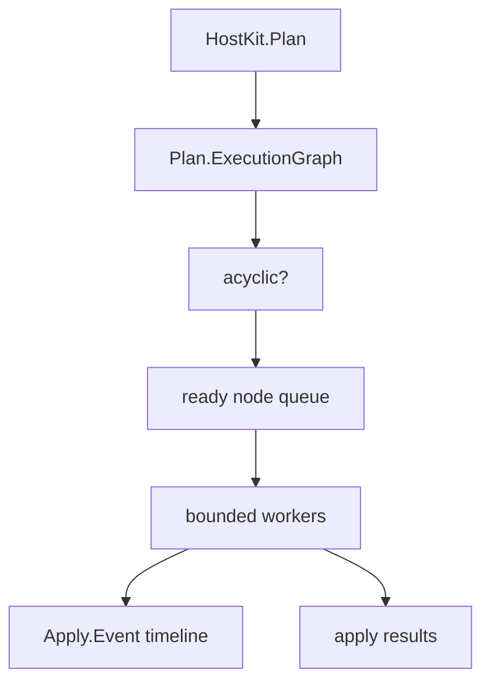

# Parallel apply design

HostKit plans are deterministic data. Parallel apply should consume that data through an explicit execution graph rather than introducing hidden async behavior inside resource applicators.

This note describes the intended direction. It is not an implementation contract yet.

## Goals

- Preserve the existing `Project -> Plan -> Apply` model.
- Keep `%HostKit.Plan{}` inspectable and deterministic.
- Use `HostKit.Plan.ExecutionGraph` as the scheduler input.
- Make `--parallel 1` equivalent to today's serial apply semantics.
- Make `--parallel N` execute only dependency-ready changes concurrently.
- Keep progress mailbox-first through `%HostKit.Apply.Event{}`.
- Keep down/rollback as ordinary down plans; graph construction handles reversed dependencies.

## Non-goals

- Do not start tasks opportunistically inside individual resource apply functions.
- Do not hide deploy engines behind recipes or providers.
- Do not make telemetry the primary apply API.
- Do not require plan artifacts to embed scheduler state.

## Execution graph

`HostKit.Plan.ExecutionGraph.build/2` derives graph nodes from active create/update/delete changes and labels ordering edges with stable reasons such as:

- declared `depends_on`,
- parent directory,
- owner/group account,
- source input,
- symlink target path,
- systemd timer/service,
- systemd file/path references,
- readiness checks.

The graph also computes topological layers and cycle diagnostics. A future scheduler should reject cyclic graphs before any resource is applied.



## Scheduler model

A scheduler can maintain:

- pending nodes,
- running nodes,
- completed nodes,
- failed/skipped nodes,
- dependency counts,
- lock ownership.

At each step, it selects nodes whose dependencies are complete and whose locks are available, then runs up to the configured concurrency limit.

Conceptually:

```elixir
HostKit.apply(plan, parallel: 1) # current serial behavior
HostKit.apply(plan, parallel: 8) # graph-scheduled behavior
```

The CLI shape can mirror that:

```sh
mix host_kit.apply --plan host_kit.plan.json --confirm --parallel 8
```

## Locks and serialization

Dependency edges alone are not enough. Some operations must be serialized even if they do not depend on the same resource.

Initial lock groups should likely include:

- package manager operations,
- systemd daemon reload and unit operations,
- same exact filesystem path,
- parent/child filesystem path mutations when not already expressed by edges,
- same systemd unit,
- commands that declare overlapping outputs/stamps.

Locks should be derived and inspectable rather than scattered across resource apply code.

## Failure behavior

A failed node should prevent dependent nodes from running. Independent nodes may either continue or be cancelled depending on policy.

Potential policies:

- `fail_fast: true` — stop scheduling new work after first failure.
- `fail_fast: false` — continue independent branches and report blocked dependents.

The default should remain conservative until dogfooding proves otherwise.

## Events

Parallel apply needs timeline-capable events. Existing mailbox-first progress should remain primary:

```elixir
%HostKit.Apply.Event{}
```

Future event payloads may need:

- graph node id,
- resource id,
- action,
- worker id,
- started/completed timestamps,
- dependency-blocked/skipped status,
- lock wait metadata.

Telemetry may mirror these events, but callers should not need telemetry to observe apply progress.

## Down plans

Down/rollback remains a plan. `HostKit.Plan.down/2` returns `%HostKit.Plan{}` and `HostKit.Plan.ExecutionGraph.build/2` already reverses dependency direction for delete changes.

A scheduler should not need a rollback-specific graph type.

## Rollout path

1. Keep graph construction and `--show-graph` as inspection tools.
2. Expand graph derivation through dogfooding.
3. Add scheduler tests against synthetic plans.
4. Add `parallel: 1` scheduler path and prove it matches current serial behavior.
5. Add bounded `parallel: N` execution behind explicit opt-in.
6. Dogfood on local/safe targets before enabling for remote production use.
